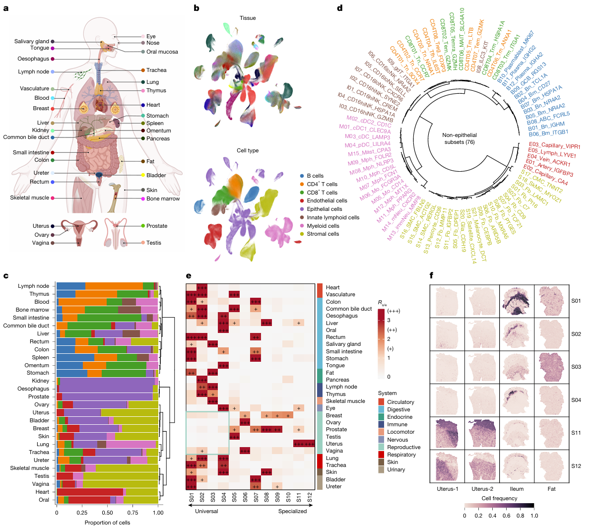
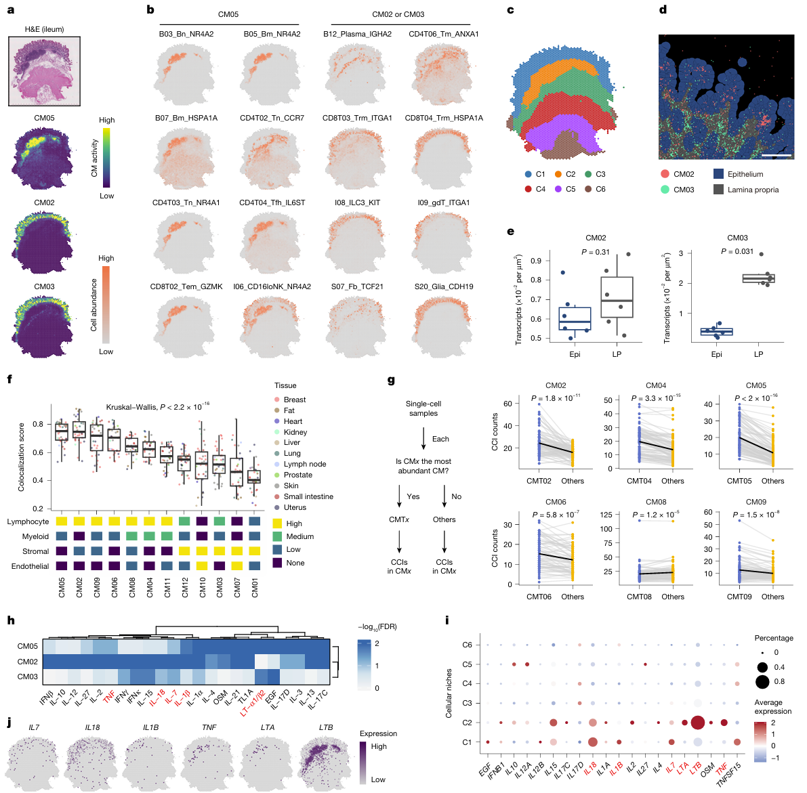

---
author:
- 序列方舟
authors:
- 序列方舟
bibliography: ref.bib
date: Invalid Date
title: 跨组织多细胞协调及其在癌症中的重塑
toc-title: Table of contents
---

# 引言

生物体的组织和器官由多种不同类型的细胞精确构建和组织，以确保生理功能的正常运行。近年来，单细胞转录组技术的进步使得科学家能够研究组织层面的多细胞生态系统。特别是诸如**人类细胞图谱（Human
Cell
Atlas）**等大型研究计划为全面解析不同组织的细胞组成提供了突破性工具。然而，跨组织细胞如何在健康状态下协同工作，以及疾病（尤其是癌症）如何改变这些模式，仍然是研究重点。本研究系统地探讨了**健康组织中的多细胞协调**，并进一步探索其在**癌症进程中的重塑机制**。

# 健康组织中的多细胞协调

本研究构建了一个**35种人类组织**的单细胞转录组数据集，涵盖**229万余个高质量细胞**，首次系统性揭示了不同组织间的细胞组成及其动态协调模式。研究团队通过分析**细胞丰度的协方差**，识别出12个细胞模块（Cellular
Modules,
CMs），这些模块在空间分布和功能层面展现出不同的**组织偏好**： 1.
**免疫细胞模块（CM05、CM06）**：主要分布于**脾脏、淋巴结和血液**，两个免疫模块在**衰老过程中表现出相反的变化趋势**。
2.
**成纤维细胞相关模块（CM07、CM12）**：主要分布于**乳腺、卵巢和子宫**，可能影响组织稳态，尤其是在更年期过程中。
3.
**血管相关模块（CM10）**：主要出现在**皮肤、心脏和脂肪组织**，提示其在**血流动力学**中的关键作用。

{width="100%"}

此外，研究团队利用**空间转录组技术**和**体内扰动实验**，进一步验证了这些**细胞模块内的跨细胞通讯**，强调其在多细胞生态系统中的关键作用
[@Shi2025].

# 癌症中的多细胞生态系统重塑

癌症不仅仅是由基因突变引起的单细胞病变，它涉及整个组织生态系统的深刻改变。研究发现，在不同类型的癌症进程中，多细胞模块发生两类系统性重塑： 1.
**健康组织的多细胞协调模式逐渐瓦解**： -
在**肺癌（LUAD）、肝癌（HCC）、肾癌（KIRC）**等癌种中，组织特异性的CM**逐步丧失**，组织结构趋向无序化。
2. **癌症微环境出现统一化的细胞模块（cCM02）**： -
**cCM02模块**在不同肿瘤类型（例如**结直肠癌、肝癌、肺癌、子宫癌**）中**同步增强**。 -
其特征包括： -
**肿瘤微环境的统一化**：免疫细胞**耗竭状态**的普遍存在。 -
**成纤维细胞活化**：促进肿瘤生长，影响**免疫逃逸**。 -
**炎症信号强化**：涉及**IFN-γ、IL-18、IL-15**等细胞因子的升高，提示其在癌症进程中的关键作用
[@Shi2025].

{width="100%"}

此外，研究还发现，癌症相关模块的**细胞间协同作用增强**，这为未来的**癌症干预策略**提供了新的研究方向。

# 研究方法与数据验证

研究团队开发了一个**计算框架（CoVarNet）**，结合**非负矩阵分解（NMF）**和**细胞丰度协方差分析**，系统性识别跨组织细胞模块。此外，研究采用**空间转录组分析**和**GTEx数据**进行交叉验证： -
**GTEx数据验证**：健康组织的跨组织CM在GTEx大规模RNA测序数据中得到**高度重现**，确保其**广泛适用性**
[@GTEx2013]. -
**空间转录组验证**：不同CM在**皮肤、肠道和乳腺**组织中的分布模式与其功能高度一致。

这种**整合单细胞数据、空间分布数据和体内功能实验**的方法，使得研究结果更具**稳健性**和**生物学意义**
[@Shi2025].

{width="100%"}

# 未来展望

本研究揭示了**跨组织细胞协调**在健康状态下的关键作用，并系统性解析了其在**癌症进程中的重塑机制**。这些发现不仅有助于理解健康组织的**稳态调控**，还能为**癌症的早期诊断、治疗和干预**提供新的视角。未来的研究可以进一步： 1.
**结合空间转录组和蛋白质组**，研究更精细的**细胞通讯网络**； 2.
**探索人工智能算法在生物医学中的应用**，自动化识别肿瘤微环境中的细胞模式；
3.
**开发针对特定细胞模块的癌症治疗策略**，特别是在**成纤维细胞和免疫细胞的功能调控方面**。

总体而言，本研究奠定了**细胞生态系统在健康与疾病中的组织级功能基础**，为生命科学和精准医学提供了新的研究方向
[@Shi2025].
